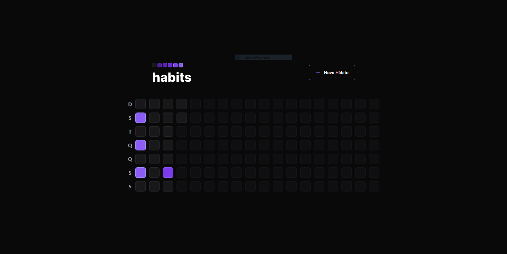
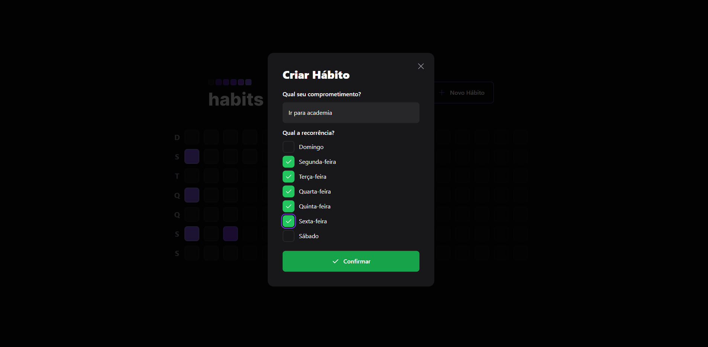
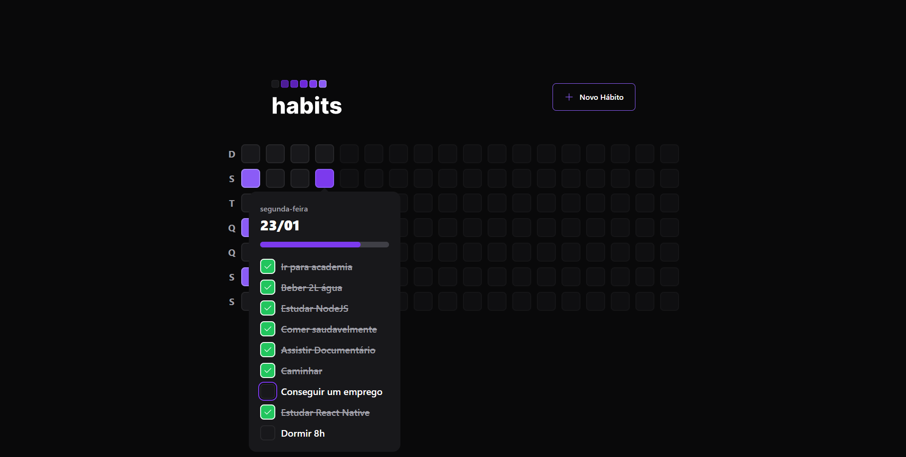

# Projeto FullStack: Habits

Projeto feito na semana NLW da rocketseat, que consiste em um aplicativo para gerencia de hábitos, podendo criar um novo hábito no banco de dados, verificar e marcar como concluido.

## Tecnologias utilizadas

_ReactNative_,
_ReactJS_,
_TypeScript_,
_React-Hooks_,
_Tailwind_,
_Prisma_,
_Radix_

## Telas  

### Home    

### Cadastrar novo hábito    

### Marcar hábito como concluído    

